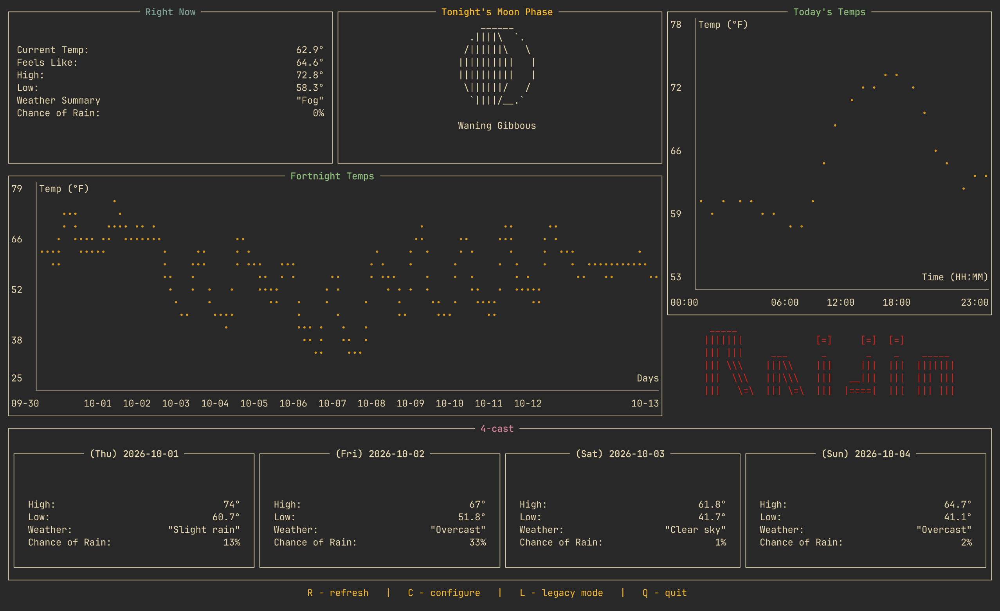
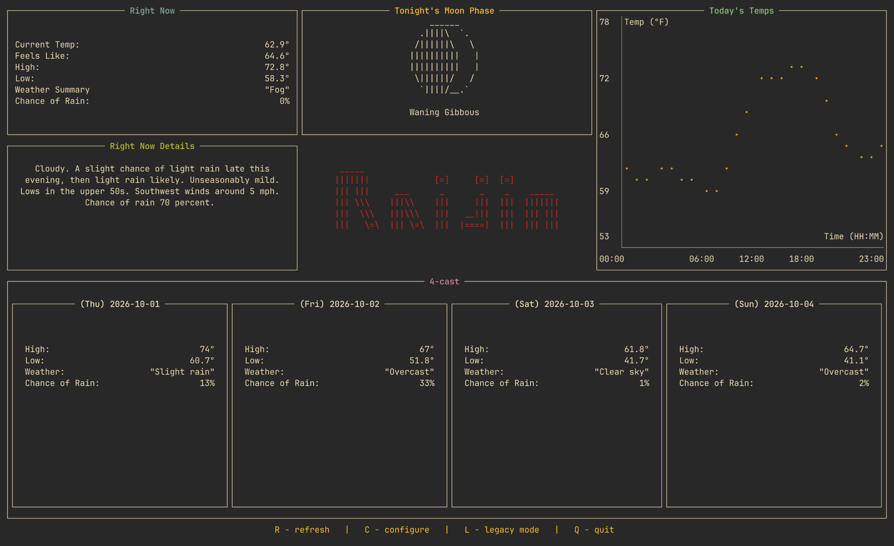
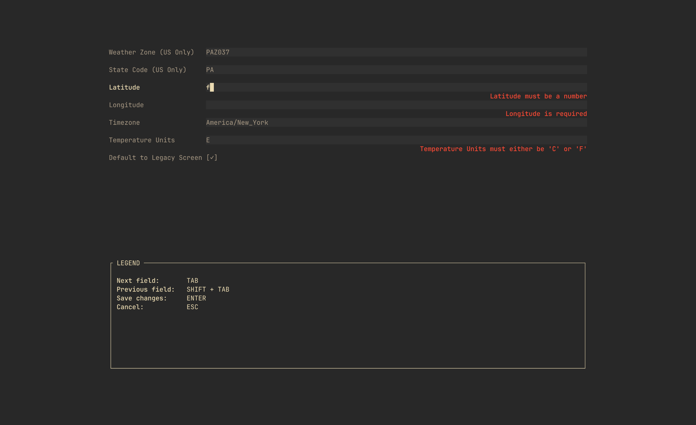

<div align="center">
  <h1>Raijin</h1>

<br />

  <p>
    A free, simple weather TUI that pulls data without the need for an API key, account, or subscription. Weather data is from <a href="https://api.weather.gov/">NWS</a> and <a href="https://open-meteo.com/en/docs">OpenMeteo</a>. Moon phase data is done with math (see how below)<br /> Only supports Mac and Linux at the moment.
  </p>

</div>

<div align="center">
  
  <p>
    <sub>
      Screenshot of the new "Global" screen
    </sub>
  </p>
</div>

<div align="center">
  
  <p>
  <sub>
  (Screenshot of the "Legacy" screen. NOTE: I'm using WezTerm with the "Gruvbox Dark (Gogh)" theme. Yours may look slightly different)
  </sub>
  </p>
</div>

<div align="center">
  
  <p>
    <sub>
      Screenshot of the new, in-app Configuration screen
    </sub>
  </p>
</div>

<br>

## New Features!
  - New Global mode (for my non-US friends! Enabled by default)
    - Layout, new Fortnight Temperature plot, and code enhancements by [Torfkopp](https://github.com/Torfkopp)
  - Legacy mode is now toggleable and off by default (this mode really only works for US users anyway)
  - You can now edit data in the app via the new Configuration screen! (no more manual edits!)
  - However, if you like manual edits, there is now a CLI to do so (run with INSERT COMMAND)
  - App now supports Celsius and Fahrenheit (I don't figure this out automatically, but you can configure it now)
  - If you have the right values set for Legacy mode, you can now set it as the default screen on load (or not)
  - Moon phases now obtained with *math* from https://github.com/FunKite/solunatus
    - This is a fantastic crate, but I opted to just steal the minimal amount of code I need to figure out the phase to cut down on program size/compile time
  - Data/environment variables can now be reloaded by pressing "R"
    - (there's no real need to do this because whenever you change the config via the Configuration screen it auto-saves/reloads, but it is helpful if you leave
    the app open all day and wanna re-grab the latest data)
  - In-app configuration screen (thanks to [ratiform](https://github.com/marc0x71/ratiform))
  - Fancy command bar at the bottom

<br>

## Installation

### Cargo

Installation via `cargo` can be done by installing the [Raijin](https://crates.io/crates/Raijin) crate:
```bash
cargo install Raijin
```
`NOTE: The default lat/long is somewhere in Tennessee. If you'd like to change it, continue on to the Setup section below`

<br>

## Usage

Once you've completed the instructions below, run by typing `Raijin` in your terminal (I have this aliased to just 'r' so I can run it quickly while I'm working)

<br>

## Setup

There are two ways to setup Raijin: for Legacy mode, or the default "Global" mode. Legacy mode gathers some data from the NWS
and only works for places in the US. Whereas Global mode only uses your Lat/Long/Timezone data and should work everywhere.

By default, the app sets you up somewhere in Tennessee. So all you need to do is run the app, go to the configuration page, and change the necessary fields.
Optionally, you can use the CLI and configure it that way.

### Global Mode Setup

First, you'll need to get some data about your location (namely, your latitude and longitude)
- Navigate to the [FindLatLng](https://www.findlatlng.org/en) website (there are many websites to find your latitude and longitude, this was just the first one I found)
- Type in your location in the search bar and click `Search`
- Jot down the latitude and longitude for this location

Next, you need to figure out what timezone you're in and its IANA name
- Navigate to the [AddEvent](https://www.addevent.com/c/documentation/tools/time-zone-lookup) website to look this up for free
- Type in your location and hit `Enter`
- Once a timezone pops up, jot down the name for later (e.g. America/New_York)

Finally, enter this info on the Configuration screen
- Run the application by typing `Raijin` in your terminal
- Hit the `C` key to open the Configuration screen
- Enter the information you just gathered and hit `Enter`

From here the app will reload everything and update the screen for you

<br><br>

### Legacy Mode Setup

First, you'll need to get some data about your location (namely, your latitude, longitude, and weather zone ID)
- Navigate to the [NWS](https://www.weather.gov/) website
- Type in your location in the top left search bar and click `Go`
- Once the page has loaded, look up at the URL search bar at the top of your browser and jot down the latitude and longitude for this location
- Then, scroll down to the `Additional Forecasts and Information` section
- Find and click the link that says `ZONE AREA FORECAST FOR <COUNTY>, <STATE>`
- In the URL search bar at the top of your browser, you should now see a zoneId at the end of that URL. It will be in the form of `<STATE>Z123` (e.g. TNZ069 which is for Knoxville, TN; in Knox county). Jot this down

Next, you need to figure out what timezone you're in and its IANA name
- Navigate to the [AddEvent](https://www.addevent.com/c/documentation/tools/time-zone-lookup) website to look this up for free
- Type in your location using the `CITY, STATE` format (e.g. Knoxville, TN) and hit `Enter`
- Once a timezone pops up, click the green `Copy` button for that result to copy the timezone to your clipboard

Now that we have the 5 pieces of data we need (latitude, longitude, 2-letter state code, weather zone ID, and timezone), let's enter this info on the Configuration screen
- Run the application by typing `Raijin` in your terminal
- Hit the `C` key to open the Configuration screen
- Enter the information you just gathered and hit `Enter`

<br>

## Develop
When editing the logo.txt or any of the moon phases, make sure every line has the exact same length (even if there are just blank lines). This will ensure that it can be centered and manipulated properly by Ratatui.

<br>

## TODO
- Rework config file setup. (Right now the way I create a config file for this is pretty lazy by just looking under `~/.config` and creating a file. But this can break if people have this symlinked for dotfile stuff. I'm sure there's a more robust way to do this)
- Auto-refresh? Idk if anyone actually wants this, but if you had this open on a dedicated display, you could have it always have fresh data without needing to interact with this.
  If this seems interesting to you, please make an issue about it (or if it already exists, comment/like it so I know it'd be useful for you)
- Test on Windows/add Windows support if it doesn't work (it should, I just haven't tested it yet)

<br>

## Why "Raijin"?
I went googling around for mythological god names related to weather/storms. "Raijin" sounded the coolest
